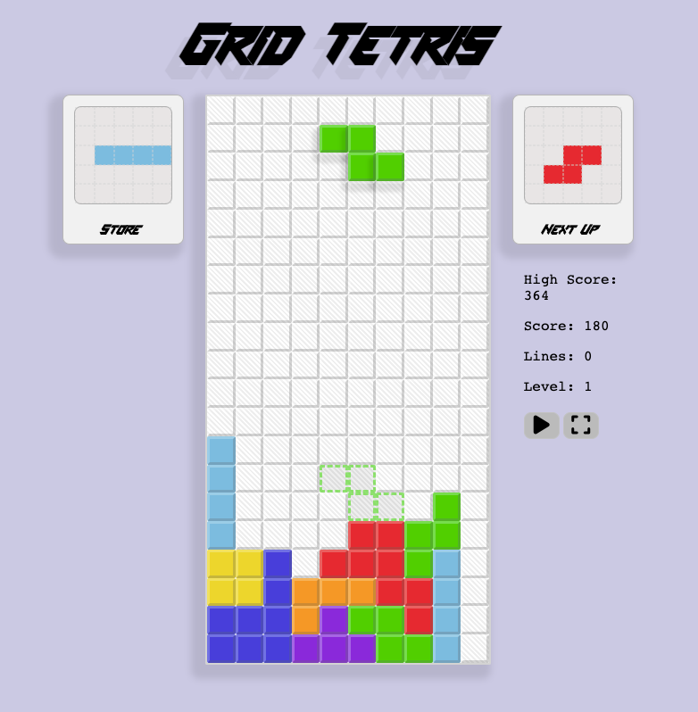
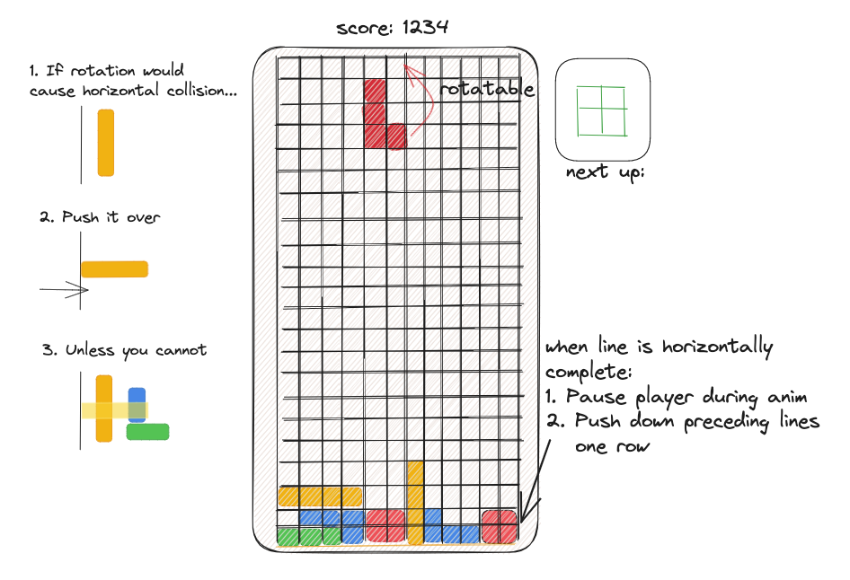

# Grid Tetris



A Tetris clone using pure CSS3 to render graphics.

Play a live build <a href="https://code.aaronishibashi.com/tetris/" target="_blank">here</a>!

## 🕹️ Controls
| Action            | Key                         |
|-------------------|-----------------------------|
| Move Horizontally | `Left` & `Right` Arrow Keys |
| Move Down         | `Down` Arrow Key            |
| Immediate Drop    | `Up` Arrow Key              |
| Rotate Block      | `Z` or `X`                  | 

| Options        | Key                        |
|----------------|----------------------------|
| Toggle Pause   | `P` or click Pause Button  |
| Toggle Target  | `T` or click Target Button |


## Technologies Used


## Installation

To build and run the project in a local server:

```shell
npm install
npm run serve
``` 
or
```shell
yarn install
yarn serve
```

## Feature List
- [x] MVP Gameplay
- [x] Pieces are immediately dropable
- [x] Show next piece
- [x] Hold a piece to the side
- [x] Pieces progressively fall at a faster rate
- [x] High Score Board
- [ ] Detect & display double, triple, quadruple row clears
- [ ] Audio (SFX, Music)

## Why

I made this project with some goals in mind:
- Learn how to apply transformations and detect collisions on a grid
- Use event polling in the DOM, and encounter possible performance limitations
- Make a game from scratch without too much framework



*Wireframe Draft*

## Challenges

- **Limiting player rotation and movement from collisions within grid bounds**
  - **Problem**: Implementing this feature was not hard by itself, but combined
  with another feature I labelled "pressure", where player attachment to the board is delayed 
  proved trying. Sometimes a block piece would attach to the board "floating midair".
  - **Solution**: I needed to refactor the movement into a once-called function 
  every frame where it's internal next-transformation state would be updated instead of 
  immediately triggering motion. This allowed for manageable movement control.
- **Creating UI overlays proved somewhat hard to manage**
  - **Problem**: Overlays are all hard-coded into the html file. I did not approach UI in 
    a modular component fashion. I left all UI in an invisible state sitting in the middle
    of the board, depending on z-index, preventing clicks getting to the right UI button or input.
  - **Solution**: I used a class to toggle the hide/show behavior. By setting pointer-events 
    to "none" when hidden fixed the layered issue, while it would be set back to "all" when shown.
    These kinds of problems will hopefully resolve itself as I use React, or attempt 
    to write future from-scratch UI with greater finesse.

## Discoveries

- **The DOM can handle 60fps calls of rendering!**
  - I've watched talks where it was said the browser waits for actual differences of values before repaint.
  - True changes to the DOM happen much less frequently than 60fps in my version of Tetris.
  - There were significant slowdowns on Safari during the game over animation, so I attempted to
    detect browsers to simplify the sequence if using it.
- **TypedArray & Array Performance Tests (Node on MacOS arm64)**
  - Copying data within a buffer is orders of magnitude faster using TypedArray, not to mention memory efficient.
  - Between a Uint8Array and a regular Array, it was actually 4x faster to index a regular JS Array.
   JavaScript numbers are Float64–an extra step might be
   taken to grab smaller data types from binary...?
  - Uint32Array and Float64Array indexing is about as fast as a regular Array.
- **Sass wasn't necessary**
  - Tried Sass, but realized I didn't need it, so I converted back to CSS part-way through.
  - I'm looking forward to when nested CSS becomes standard.
- **I'm pretty lousy at UI design**
  - Time to team up with a designer?

## Next Steps

- Refactor view using React.
- PvP online battle Tetris.
- Go on to the next thing.
